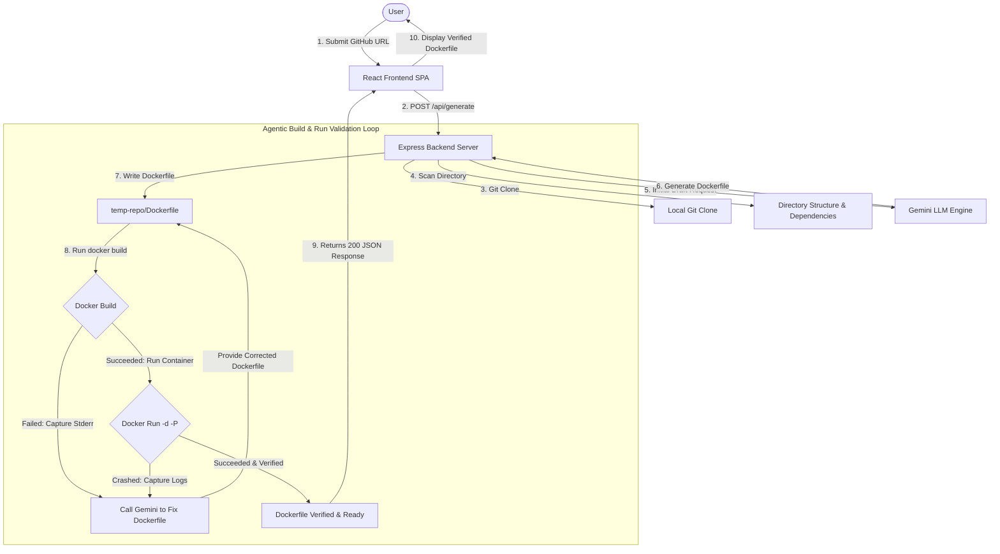

# 🐳 DockerForge — AI-Powered Dockerfile Generator

DockerForge is an agentic, full-stack AI coding assistant that clones a GitHub repository, scans its file tree structure and dependencies, generates an optimized multi-stage production Dockerfile using the **Gemini API**, validates it using a local Docker engine, and runs self-repair loop cycles to dynamically fix build-time or runtime crash logs.

---

## 🏗️ Architecture & Core Workflow

The system is split into a **React SPA frontend** and a **Node.js Express backend**, coordinating an agentic self-repair validation loop.



---

## 🛠️ Step-by-Step Flow Details

1. **GitHub Ingestion:** The user submits a public repository URL in a beautifully styled glassmorphism React panel supporting complete dark/light mode integration.
2. **Analysis:** The backend clones the repository into a temp path, scans files recursively, extracts main dependency packages (`package.json`, `requirements.txt`, etc.), and passes this structure as clean context to the Gemini LLM.
3. **Agentic Validation Loop (Up to 3 Retries):**
   * **Stage A (Build Validation):** Triggers `docker build` capturing build-time syntax or resolution errors.
   * **Stage B (Runtime Validation):** Runs the built image inside a sandboxed container using `docker run -d -P`. Waits 4 seconds for services to boot and inspects whether the container is in the `Running` state. If the container exposes a port, it pings the service to ensure it responds to HTTP requests.
   * **Stage C (Self-Repair):** If either building fails or the container crashes on boot, the system extracts the full console logs/stderr and feeds them back into the LLM as dynamic debugging feedback to fix the Dockerfile.
4. **Graceful Offline Degradation:** If the system detects that your local Docker daemon is closed or not installed, the tool **still generates** a highly optimized Dockerfile, skipping the validation phases and prompting you with a friendly, styled alert rather than crashing.

---

## 🚀 Setup & Execution Guide

### Method A: Docker Execution (Recommended - Out of the Box)

We have Dockerized the tool itself using **Docker-out-of-Docker (DooD)**. By mounting the host's Docker socket, the containerized application can run verification builds directly on your machine.

1. **Clone the DockerForge project:**
   ```bash
   git clone https://github.com/ramkaranpatel4661/DockerForge
   cd DockerForge
   ```

2. **Configure Environment Variables:**
   Create a `.env` file at the project root:
   ```env
   GEMINI_API_KEY=your_google_gemini_api_key_here
   GEMINI_MODEL=gemini-flash-latest
   ```

3. **Launch DockerForge:**
   ```bash
   docker-compose up --build
   ```
   Open your browser and navigate to **[http://localhost:3000](http://localhost:3000)**!

---

### Method B: Local Development Setup

To run both services locally on your host environment:

#### 1. Backend Server Setup
```bash
cd backend
npm install
# Create a .env file:
# PORT=3000
# GEMINI_API_KEY=your_key_here
# GEMINI_MODEL=gemini-flash-latest
npm run dev
```

#### 2. Frontend Development Server
```bash
cd frontend
npm install
npm run dev
```
Open **[http://localhost:5173](http://localhost:5173)** to access the app in hot-reload development mode!

---

## 🤖 LLM Provider Selection & Quota Optimizations

We use **Google Gemini API** due to its state-of-the-art reasoning, exceptionally fast JSON text generation, and generous free tier allowances.

> [!IMPORTANT]
> **Why we transitioned default fallbacks to `gemini-flash-latest`:**
> * Active versioned models (e.g. `gemini-2.5-flash`, `gemini-3.5-flash`) have a strict rate-limiting quota of **20 requests per day** on Google's free tier. In an agentic repair loop, this quota can be exhausted rapidly, resulting in immediate 429 quota exhaustion errors.
> * The **`gemini-flash-latest`** model provides a highly stable, production-grade alias linked to a generous rate-limit of **1,500 requests per day** (15 RPM).
> * The backend dynamically queries `gemini-flash-latest` by default to ensure maximum stability and unlimited developer experimentation.

---

## ⚠️ Known Limitations & Edge Cases

* **Private Repositories:** The current version only clones public GitHub repositories as no credential ingestion has been built yet.
* **Complex Multi-service Repositories:** Repositories that rely on external databases or caches (e.g., PostgreSQL, Redis) may start but fail the HTTP response check unless mock services or inline databases (SQLite) are configured in the target code, or a `docker-compose.yml` generation module is added.
* **Heavyweight Build Contexts:** Large repository assets (like local media or model binary files) might increase git clone times and slow down local `docker build` times during validation.
